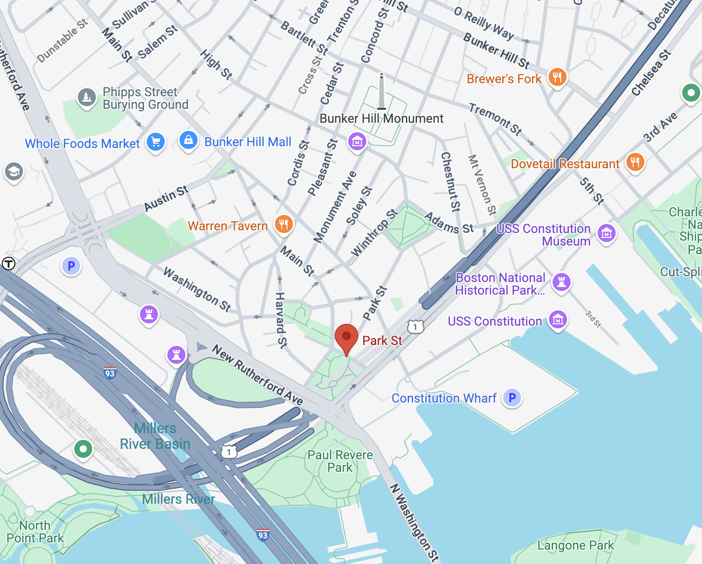
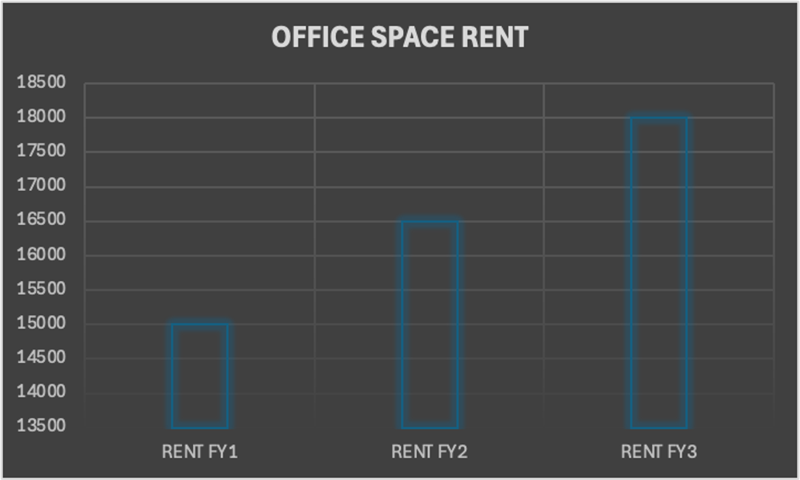

---
format:
  html:
    theme: flatly
    css: styles.css
    toc: false
    grid:
      body-width: 1000px
---

::: {.columns}
::: {.column width="50%"}
# Park Street Brew Co.

### Objective & Analysis Tools: 
- To deliver strategic recommendations for the successful establishment of a brewery, using market analysis, financial analysis, Innovation  and operational insights.
- To establish a strong foothold  in the market and drive growth in a competitive landscape.

### Analysis on functional areas:

- Operations 
- Innovation
- HR Management
- Marketing
- Financial Management

### About The Brewery

**Location:** Park Street

- Tourism:  Park Street is a historic area, and Boston's Freedom Trail runs through it, attracting tourists year-round.
- Events:  Festivals, sports events, or concerts nearby can significantly increase foot traffic and brewery visits.
- Corporate offices: There are lots of corporate offices nearby the area, which makes it more accessible & feasible  for customers to visit the nearby breweries or cafes.

### Establishing Marketing Strategy
## Advertising Tactics
The brew lab  would be focusing upon the 4 major Advertising  strategies:

- Print media : $19276.835
- Seo: $20000.0
- trade shows: $20000.0
- social media marketing:$28794.725
- local adversting: $78071.56

:::

::: {.column width="50%"}

### Establishing Financial Strategy

:::
:::

